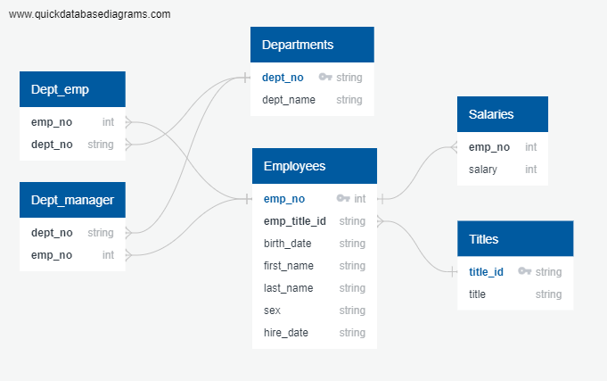
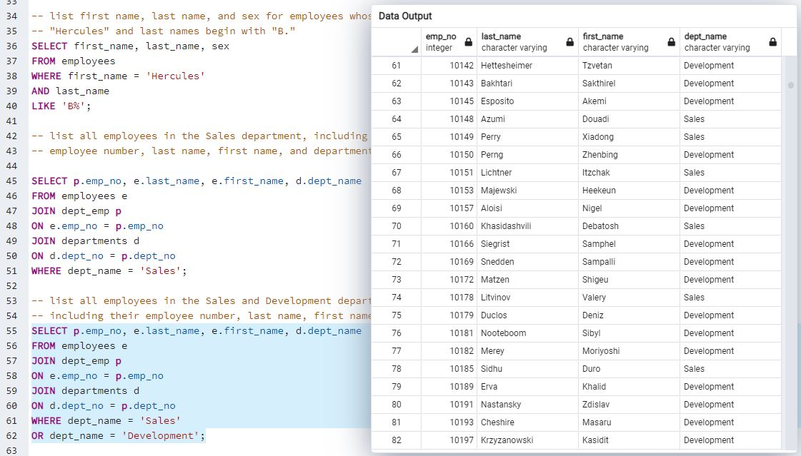
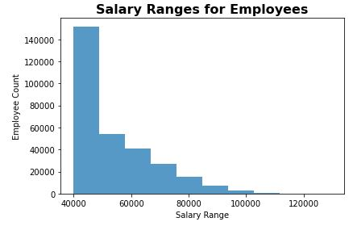
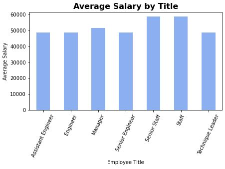

# SQL - Employee Database

Data engineering and analysis researching employess of a hypothetical corporation.  Datasets on the corporation and its employess from the 1980s and 1990s came in the form of six CSV files.

Designed tables to hold CSV data, imported CSVs into a SQL database (pgAdmin), and performed data analysis through SQL queries.

Many of the solutions involved using JOIN to access data across multiple SQL tables.  Additional analysis involved using SQLAchemy to import the SQL database into Pandas.

### EmployeeSQL folder described:

QuickDBD_SQL-challenge.png: Image file of the entity relationship diagram created using http://www.quickdatabasediagrams.com.

- - -

**table_schemata.sql:** CSV files imported into corresponding SQL table in pgAdmin.

**queries.sql:** Data analysis performing SQL queries for a variety of cross-table information, for example: first name, last name, and hire date for employees who were hired in 1986; all employees in the Sales and Development departments (displayed above), including their employee number, last name, first name, and department name, etc.

- - -

**Bonus_Analysis.ipynb:** Additional analysis utilizing SQLAlchemy to import the SQL database into Pandas.  Includes queries for the histogram visualizing the most common salary ranges for employees, and the bar chart of average salary by title, to qualify the spurious nature of the dataset.